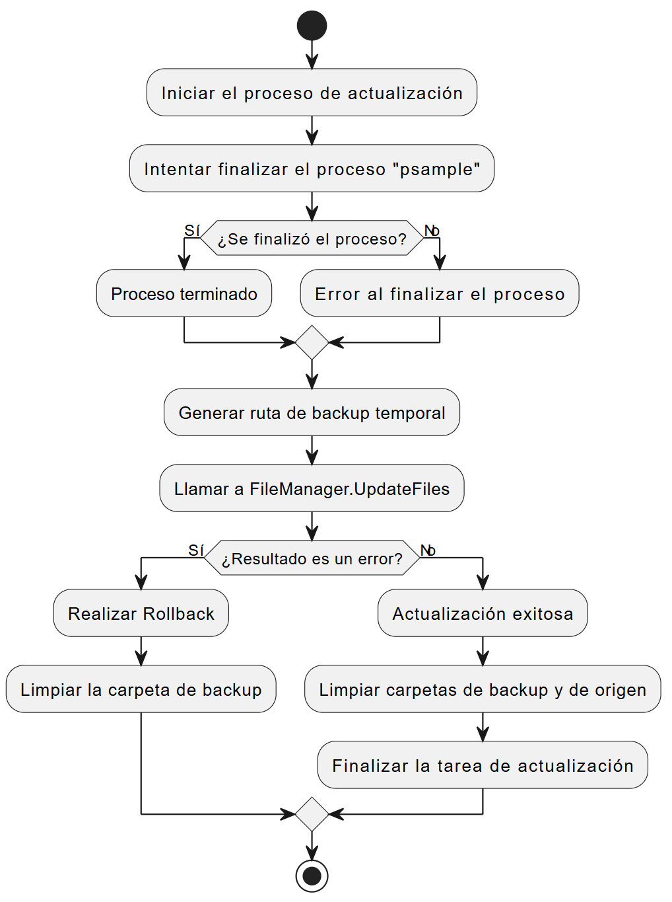
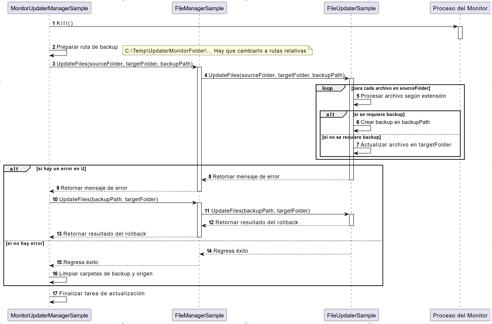
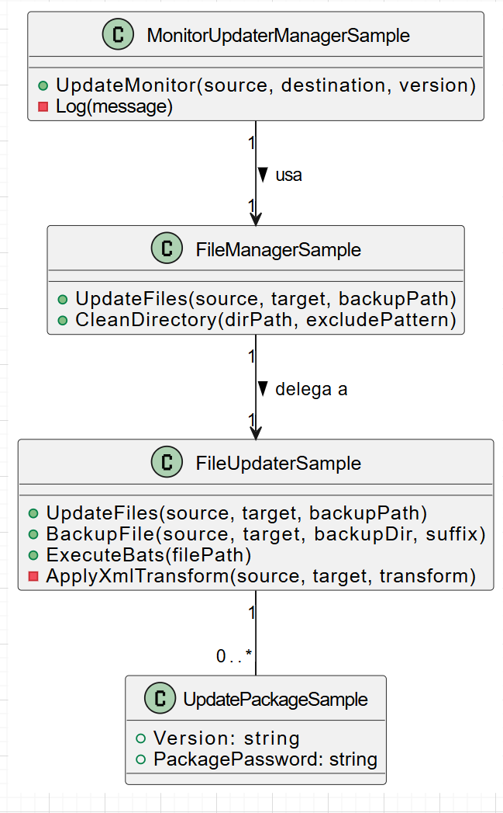
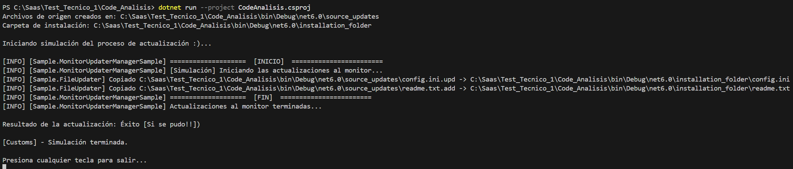

Este repositorio contiene un sistema de actualización de archivos para una aplicación de monitoreo.

El sistema se encarga de:

- Detener la aplicación para poder actualizar sus archivos.
- Crear una copia de seguridad (backup) de los archivos originales por si algo falla.
- Actualizar, añadir o eliminar archivos basándose en la extensión de los nuevos archivos de actualización.
- Si hay un error, el sistema puede deshacer todos los cambios usando el backup (proceso de rollback).
- Al finalizar, limpia todos los archivos temporales y de backup.

No subas los compilados al repo

## Evidencias

## Evidencias

Las siguientes imágenes en la carpeta `Evidencias` muestran la ejecución y resultados de la simulación:

### Diagramas del proyecto

Puedes ver los diagramas detallados del proyecto (flujo, secuencia y clases) en el siguiente enlace:

[Ver diagramas en Google Drive](https://drive.google.com/file/d/1vKQ9wY4G5URAhOp6-oJoeeyo1Bof9oBx/view?usp=sharing)

---

Más detalles técnicos y uso en `README` del proyecto.
